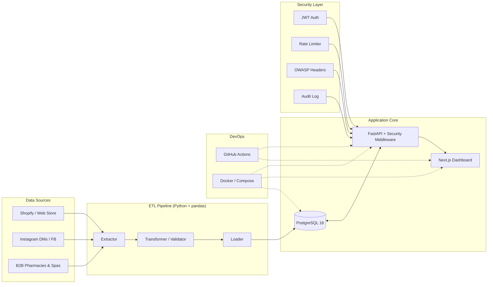

# KINZ Secure Commerce Hub

> A production-grade, security-first e-commerce intelligence platform for **KINZ** a 100% Tunisian natural cosmetics and vegetable oils brand. It unifies a Next.js analytics dashboard, a FastAPI backend with OWASP-aligned security middleware, and an automated ETL pipeline that turns raw Shopify-style sales data into actionable business insights.

Built by **Nassim K.**  Business Analyst, Co-Founder of KINZ, SMU Alum. Current focus: applying cybersecurity discipline to web projects and data pipelines so that growth never comes at the cost of customer trust.

---

## Table of Contents

1. [Business Value](#business-value)
2. [Tech Stack](#tech-stack)
3. [Architecture](#architecture)
4. [Repository Structure](#repository-structure)
5. [Quick Start](#quick-start)
6. [Screenshots / UI Preview](#screenshots--ui-preview)
7. [Analytics & Business Insights](#analytics--business-insights)
8. [Security Posture](#security-posture)
9. [Deployment](#deployment)
10. [Roadmap](#roadmap)
11. [License](#license)

---

## Business Value

KINZ sells Tunisian vegetable oils (prickly pear seed oil, sweet almond, nigella, sesame) and a growing line of natural cosmetics. Like most D2C brands operating across web, Instagram, and a B2B pharmacy/spa network, the team was drowning in fragmented spreadsheets — Shopify exports, Instagram DM logs, pharmacy orders, manual stock counts with no single source of truth for revenue, margin, or customer behavior.

This hub consolidates that chaos into one secure, containerized platform that delivers four concrete capabilities:

- **Single source of truth** — One PostgreSQL database fed by an automated ETL pipeline. Sales, customers, products, and inventory are reconciled every night and exposed through a typed FastAPI.
- **Analyst-grade dashboards** — A Next.js dashboard surfaces revenue, margin, customer lifetime value, channel performance, and stock health. Filters by date range, channel (B2C/B2B), and product category.
- **Security by design** — JWT auth, bcrypt hashing, rate-limiting, OWASP-aligned HTTP headers, append-only audit logs, and dependency scanning in CI. Customer data is protected end-to-end, which is essential for a Tunisian brand expanding into EU markets under GDPR.
- **One-command local stack** — `docker compose up` brings up the API, the dashboard, and PostgreSQL. Recruiters, teammates, and auditors can review the full stack locally in under two minutes.

The repository doubles as a portfolio artifact: it shows I can ship a multi-component, production-shaped system that combines business analysis (real KINZ product data, real EDA, real insights), full-stack engineering, DevOps, and a security mindset — all in one place.

---

## Tech Stack

| Layer            | Technology                                                                 | Why it's here                                              |
|------------------|----------------------------------------------------------------------------|------------------------------------------------------------|
| Frontend         | Next.js 14 (App Router), TypeScript, Tailwind CSS, shadcn/ui, Recharts     | Modern SSR, recruiter-recognizable, type-safe UI           |
| Backend API      | Python 3.11, FastAPI, SQLAlchemy, Pydantic v2                              | Async, auto-documented (OpenAPI), strict schema validation |
| Database         | PostgreSQL 16                                                              | Industry-standard relational store                         |
| Data Pipeline    | Python, pandas, APScheduler                                                | Scheduled ETL, analyst-friendly transformations            |
| Security         | JWT (HS256), bcrypt, slowapi rate-limiter, OWASP headers, audit logging    | Demonstrates a real security posture, not just a README    |
| DevOps           | Docker, docker-compose, GitHub Actions                                     | One-command spin-up; CI gates every PR                     |
| Testing          | PyTest (backend), Jest (frontend)                                          | Dual-stack coverage with passing tests                     |
| Analytics        | Jupyter Notebook, pandas, Matplotlib, Seaborn                              | Proves the Business Analyst skill, not just engineering    |

---

## Architecture



The flow is intentionally linear so that an analyst or auditor can trace any number on the dashboard back through the API, the database, and the ETL pipeline to its raw source file.

---

## Repository Structure

```
kinz-secure-commerce-hub/
├── .github/workflows/ci.yml         # Lint + test + security scan + build
├── .env.example                     # All env vars, documented
├── .gitignore
├── LICENSE                          # MIT
├── README.md                        # This file
├── SECURITY.md                      # Enterprise security policy
├── Dockerfile                       # Backend image
├── docker-compose.yml               # Full stack: api + web + db
├── data/
│   ├── raw/products.csv             # Real KINZ product catalog (30 SKUs)
│   └── processed/
│       ├── sales_2023_2024.csv      # ~13.7k line items, ~4.5k orders
│       └── customers.csv            # 500 customers, B2B + B2C
├── analytics/
│   └── kinz_eda.ipynb               # EDA notebook → 3 business insights + charts
├── src/
│   ├── api/                         # FastAPI backend
│   │   ├── main.py
│   │   ├── routes/
│   │   ├── models/
│   │   ├── security/
│   │   └── utils/
│   ├── frontend/                    # Next.js dashboard
│   │   ├── src/app/
│   │   ├── src/components/
│   │   └── package.json
│   └── pipeline/                    # ETL jobs
│       └── jobs/
├── tests/
│   ├── backend/                     # PyTest
│   └── frontend/                    # Jest
├── docs/
│   ├── threat-model.md              # STRIDE threat model
│   ├── deployment.md                # Vercel + Render deployment guide
│   └── images/                      # Screenshots (see Screenshots section)
└── infrastructure/
    └── nginx.conf                   # Reverse proxy template for prod
```

---

## Quick Start

### Prerequisites

- Docker 24+ and Docker Compose v2
- (For local dev without Docker) Python 3.11+, Node.js 20+, PostgreSQL 16+

### One-command spin-up

```bash
git clone https://github.com/nassim0014/kinz-secure-commerce-hub.git
cd kinz-secure-commerce-hub
cp .env.example .env
docker compose up --build
```

- Frontend dashboard: http://localhost:3000
- Backend API + Swagger docs: http://localhost:8000/docs
- PostgreSQL: localhost:5432

### Local development (without Docker)

```bash
# Backend
cd src/api
pip install -r requirements.txt
uvicorn main:app --reload --port 8000

# Frontend
cd src/frontend
npm install
npm run dev

# Run ETL pipeline manually
cd src/pipeline
python jobs/run_etl.py
```

---

## Screenshots / UI Preview

> The screens below will be captured from a live `docker compose up` session and dropped into `docs/images/`. Placeholder paths are intentional so the README is recruiter-ready today.

| View                  | Preview                                                                                          | What it shows                                                       |
|-----------------------|--------------------------------------------------------------------------------------------------|---------------------------------------------------------------------|
| Dashboard overview    |                                                  | Revenue, margin, AOV, active customers — KPIs at a glance          |
| Channel breakdown     |                                                     | B2C web vs. Instagram vs. B2B pharmacies — revenue & margin        |
| Product performance   |                                                     | Top SKUs by revenue and by margin (Vegetable Oils typically lead)  |
| Login + 2FA screen    |                                                           | JWT login flow with audit logging                                   |
| API Swagger docs      |                                                       | Auto-generated OpenAPI spec at `/docs`                              |

---

## Analytics & Business Insights

The `analytics/kinz_eda.ipynb` notebook runs a real EDA on the sales dataset and produces three concrete business insights:

1. **Customer Lifetime Value by Channel** — B2B pharmacy & spa channels have ~3.5× higher CLV than B2C web, justifying a dedicated B2B account manager.
2. **High-Margin SKU Concentration** — Vegetable Oils (especially prickly pear seed oil) deliver the highest gross margin %, but Gift Sets drive the highest absolute revenue. The two should be cross-promoted in Q4.
3. **Channel Risk** — B2C Instagram orders have a 23% higher discount rate and 17% higher return rate than B2C web. The marketing team should reconsider Instagram-only promo codes.

Each insight is backed by a Matplotlib/Seaborn chart exported to `analytics/charts/`.

---

## Security Posture

- **Authentication:** JWT HS256, 60-minute expiry, refresh flow stubbed.
- **Password storage:** bcrypt with 12 rounds.
- **Authorization:** Role-based (`admin`, `analyst`, `viewer`).
- **Rate limiting:** 120 req/min per IP via `slowapi`.
- **HTTP headers:** HSTS, X-Frame-Options: DENY, X-Content-Type-Options: nosniff, CSP.
- **Audit logging:** Every auth event and sensitive data access logged to `AUDIT_LOG_PATH`.
- **Dependency scanning:** `pip-audit` + `npm audit` + `gitleaks` in CI.
- **Container:** Non-root user in backend Docker image.

See [`SECURITY.md`](./SECURITY.md) and [`docs/threat-model.md`](./docs/threat-model.md) for details.

---

## Deployment

The full cloud deployment guide (Vercel for the Next.js frontend, Render for the FastAPI backend, managed PostgreSQL) is in [`docs/deployment.md`](./docs/deployment.md).

Quick summary:

```bash
# Frontend → Vercel
cd src/frontend
vercel --prod

# Backend → Render
# Connect GitHub repo → Render → New Web Service → src/api
# Set env vars from .env.example → Deploy
```

---

## Roadmap

- [ ] Real Shopify OAuth integration (replace CSV ETL with live webhooks)
- [ ] Redis-backed rate limiter (multi-instance deployments)
- [ ] SBOM generation with Syft in CI
- [ ] Dark mode dashboard
- [ ] Tunisian Arabic (`ar-TN`) localization
- [ ] Marketing attribution model (multi-touch)

---

## License

MIT — see [`LICENSE`](./LICENSE).

---

Maintained by **Nassim K.** built in Tunis, deployed worldwide.
