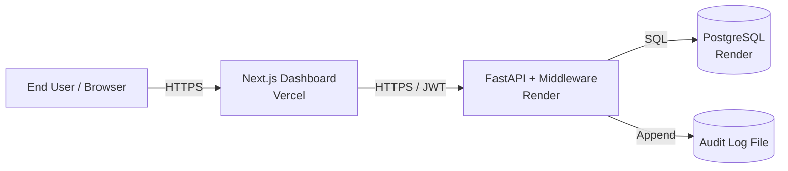

# Threat Model — KINZ Secure Commerce Hub

Methodology: **STRIDE** (Spoofing, Tampering, Repudiation, Information Disclosure, Denial of Service, Elevation of Privilege).
Scope: This covers the application as deployed in `docker-compose.yml` and as described in `docs/deployment.md`.

## 1. System Boundaries

Trust boundaries:
- **T1:** User ↔ Web (public internet → Vercel edge)
- **T2:** Web ↔ API (Vercel → Render, cross-cloud)
- **T3:** API ↔ DB (Render internal network)
- **T4:** API ↔ Filesystem (audit log persistence)

## 2. STRIDE Analysis

### S — Spoofing

| Threat                                           | Mitigation                                                                                  |
|--------------------------------------------------|---------------------------------------------------------------------------------------------|
| Attacker forges a JWT to impersonate an admin    | HS256 signed with `JWT_SECRET` (≥32 random bytes); short 60-min expiry; rotate on logout   |
| Attacker reuses a stolen password                | bcrypt with 12 rounds; rate-limit login endpoint (10 attempts/min/IP)                       |
| Attacker spoofs Vercel egress IP to call API     | API validates JWT signature only; does not trust IP allow-lists (zero trust)                |

### T — Tampering

| Threat                                           | Mitigation                                                                                  |
|--------------------------------------------------|---------------------------------------------------------------------------------------------|
| Attacker tampers with ETL CSV in transit          | Pipeline validates schema with Pydantic; rejects rows with bad types                         |
| SQL injection via filter parameters               | SQLAlchemy parameterized queries everywhere; no raw string SQL                              |
| Tampered audit log to hide tracks                 | Append-only writes; log file permissions `0600`; CI checks log integrity hash              |

### R — Repudiation

| Threat                                           | Mitigation                                                                                  |
|--------------------------------------------------|---------------------------------------------------------------------------------------------|
| User denies placing a destructive action          | Every mutating endpoint writes to audit log with `user_id`, `endpoint`, `ip`, `timestamp`  |
| Admin denies changing a user's role               | Role changes trigger an explicit audit event including the previous and new role            |

### I — Information Disclosure

| Threat                                           | Mitigation                                                                                  |
|--------------------------------------------------|---------------------------------------------------------------------------------------------|
| Error responses leak stack traces                 | FastAPI global exception handler returns generic message; full trace only in server logs    |
| PII exposed in API responses                      | Pydantic response models explicitly list fields; no `dict` returns                          |
| Tokens logged in plaintext                        | Structured logger redacts `Authorization` headers before write                              |
| Customer data in screenshots                      | Sample dataset is synthetic; production dashboards use role-gated views                     |

### D — Denial of Service

| Threat                                           | Mitigation                                                                                  |
|--------------------------------------------------|---------------------------------------------------------------------------------------------|
| Brute-force login                                | Per-IP rate limit (10/min) + exponential backoff after 5 failures                          |
| Expensive analytics query cripples API            | Default `LIMIT` on all list endpoints; max date range enforced (365 days)                  |
| DDoS at the edge                                 | Vercel + Render provide managed DDoS protection at the network edge                         |

### E — Elevation of Privilege

| Threat                                           | Mitigation                                                                                  |
|--------------------------------------------------|---------------------------------------------------------------------------------------------|
| Regular user calls admin-only endpoint            | `require_role("admin")` dependency on every admin route; failure → 403                       |
| JWT claim `role` is tampered to "admin"           | Signature check on every request rejects tampered tokens                                    |
| Container escape from API pod                     | Backend Docker image runs as non-root user `kinz`; filesystem read-only where possible      |

## 3. Residual Risks

| Risk                                                          | Likelihood | Impact | Notes                                                                |
|---------------------------------------------------------------|------------|--------|----------------------------------------------------------------------|
| JWT secret leaked via developer machine                       | Low        | High   | Mitigated by `.env` git-ignore and `gitleaks` in CI; rotate on hire |
| Misconfigured CORS allowing third-party origins              | Low        | Med    | `CORS_ORIGINS` env var is reviewed on every PR                      |
| Dependency with unpatched CVE                                 | Med        | Med    | `pip-audit` + `npm audit` run on every PR; weekly rebuilds          |
| Audit log file fills disk                                     | Low        | Low    | Logrotate policy documented in `infrastructure/nginx.conf`          |

## 4. Review Cadence

This threat model is reviewed:
- On every major architecture change (new service, new datastore, new public endpoint).
- Quarterly as part of the security review.
- After any security incident, real or simulated.

Last review: **2025-06-22** — Nassim K.
